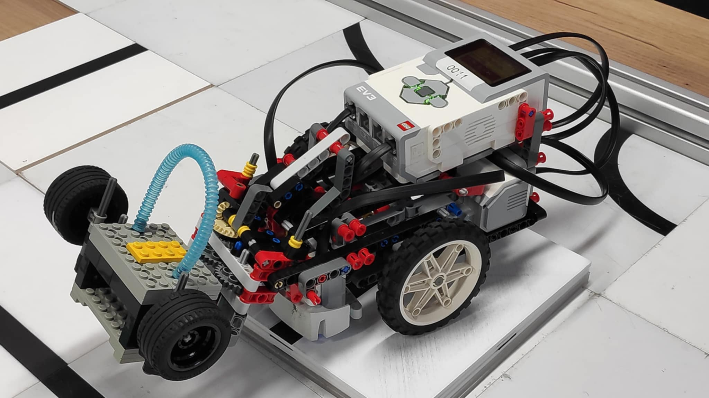
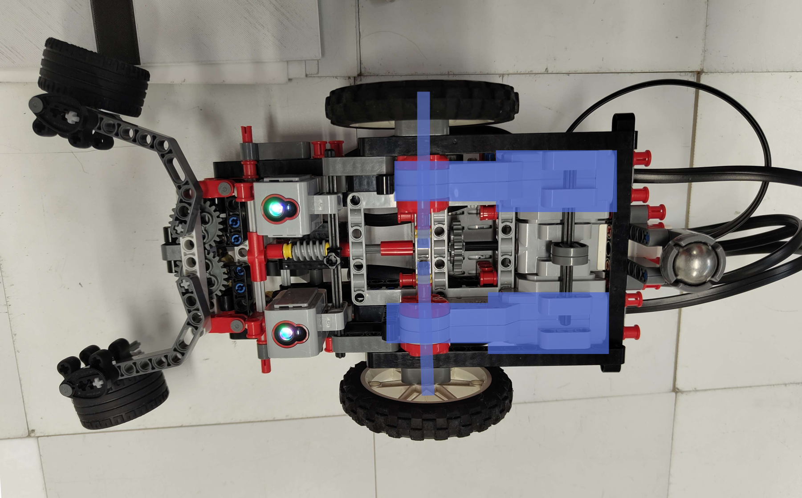
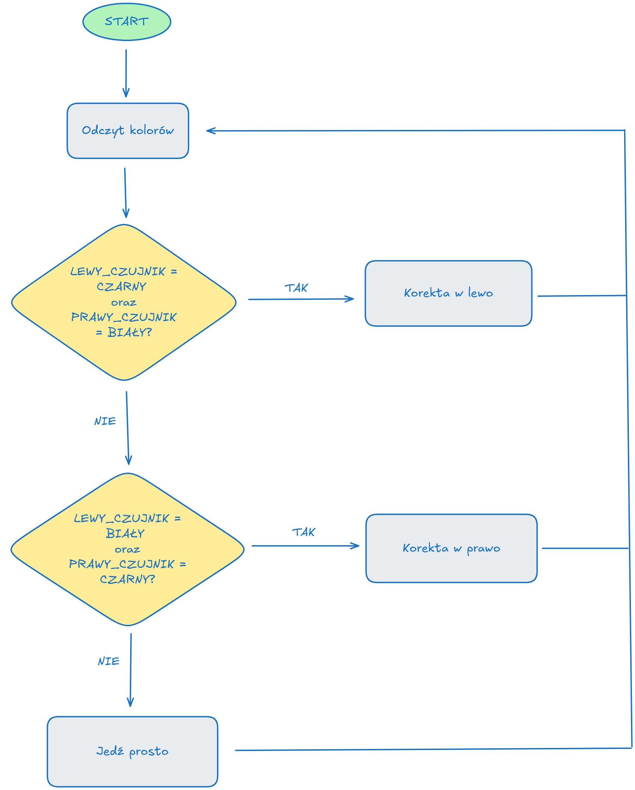
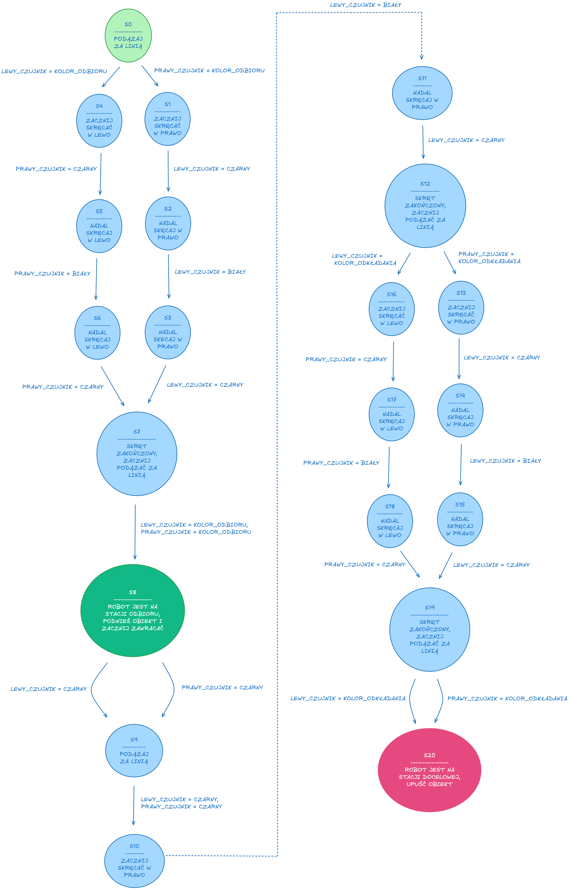

## Dokumentacja projektu

- Przedmiot: Wstęp do robotyki dla informatyków

- Data: 18.05.2025

- Autorzy:

  - Sebastian Abramowski

  - Aleksander Stanoch

### Konstrukcja robota

|  |  |
|:--:|:--:|

#### Układ jezdny:
Dwa 'duże' silniki podłączone *(zaznaczone na niebiesko)* połączone są bezpośrednio z koła, zrobie zostało to aby ograniczyć luzy pomiędzy kołami a silnikami.<br>
Robot posiada 2 koła napędowe oraz 3ci punkt podparcia z tyłu, taka kontrukcja pozwala na obrót wokół własnej osi.<br>



#### Czujniki

Robot posiada 2 czujniki koloru, znajdujący się z przodu robota, zamontowane są one na szynie co umożliwia łatwe ustawienie ich odległosi względem siebie.<br>
Ich odległość od środka podyktowana jest dwoma czynnikami:
1. Im mniejsza odległość od środka tym szybciej robot reaguje na odstępstwo od lini
2. Z kolei zbyt mała odległość sprawia że robot ma problemy z pokonaniem zakrętu o koncie 90°.


#### Podnoszenie:

|  |  |
|:--:|:--:|

|||
|:--:|:--:|
|  | 'średni' silnik zamontowany jest między 'dużymi' sinikami, podłączony jest wałem do przekładni ślimakowej z przodu robota |
|  | Z przodu robot posiada chwytak, składający się z dwóch ramion, połączonych zebatkami. Ramiona posiadają gumowe elementy aby lepiej trzymać podniesione obiekty. |
|  | W momęcie gdy 'średni' silnik obraca przekładnie ślimakową *(filoetowy prostoką na zdjęciu)*, koło zębate obraca się zgodnie z kierunkiem niebieskich strzałek. Na zdjęciu *(zaznaczone na niebiesko)* jest ramie połączone przegubami *(zaznaczne na zielono)* |
|  | Ruch ramienia do środka robota sprawia że chytak zamyka się |
|  | W momęcie gdy chytak zamknie się, ramię przesuwa się dalej w kierunku środka robota, co sprawia że obraca się na osi *(zielony punk na zdjęciu)*, podnosząc trzymany obiekt |


### Algorytm Linefollowera

Zastosowaliśmy `prosty, klasyczny algorytm` oparty na dwóch czujnikach koloru umieszczonych z przodu robota, po obu stronach linii.

Gdy oba czujniki widzą kolor biały, oznacza to, że między nimi znajduje się linia (czyli kolor czarny), dlatego robot kontynuuje jazdę prosto. Jeśli oba czujniki widzą czarny, traktujemy to jako skrzyżowanie — również w tym przypadku robot jedzie prosto.

Jeśli prawy czujnik wykryje czarny kolor, oznacza to, że robot zjeżdża z linii w lewo — należy wtedy skręcić w prawo. Analogicznie, gdy lewy czujnik wykryje czarny, robot koryguje tor jazdy skrętem w lewo.

Prędkości kół zostały dobrane eksperymentalnie tak, aby zapewnić stabilną jazdę oraz możliwość pokonywania zakrętów bez wypadania z trasy.

Implementację umieściliśmy w pliku `linefollower.py`

Schemat blokowy algorytmu:



#### Wykrywanie kolorów przy algorytmie Linefollowera

Ponieważ linefollower wymagał rozpoznawania tylko dwóch kolorów — czarnego i białego — zastosowaliśmy prostą `metodę opartą na analizie wartości RGB zwracanych przez czujniki`. Jeśli wartości były niejednoznaczne, wspomagaliśmy się nazwą koloru (color_name) zwracaną przez czujnik. Kolory podobne do czarnego (np. "Black", "Brown") traktowaliśmy jako czarny, a kolory jasne (np. "White", "Yellow") jako biały.

Takie podejście było wystarczająco niezawodne — podczas działania linefollowera nie napotkaliśmy większych problemów z wykrywaniem kolorów.

Kod rozpoznawania kolorów:

```python
def get_color_from(sensor):
	red, green, blue = sensor.rgb

	if red > 90 and green > 170 and blue > 100:
		return Color.WHITE

	if red < 35 and green < 65 and blue < 35:
		return Color.BLACK

	if sensor.color_name in ["Black", "Brown"]:
		return Color.BLACK

	if sensor.color_name in ["White", "Yellow", "Blue", "Green"]:
		return Color.WHITE

	return Color.UNKNOWN
```

### Algorytm Transportera

W przeciwieństwie do prostego linefollowera, algorytm transportera wymagał znacznie bardziej złożonego podejścia. Jego zadaniem było samodzielne przejechanie robota przez trasę, rozpoznanie miejsca odbioru i miejsca docelowego, a także wykonanie odpowiednich manewrów skręcania i chwytania obiektu.

Podstawą działania transportera był `automat skończony składający się z 21 stanów`, w którym każdy stan odpowiadał konkretnemu etapowi misji — np. jazda po linii, wykrycie punktu odbioru, skręt w lewo/prawo, chwycenie przedmiotu, zawrócenie, dotarcie do punktu docelowego i oddanie obiektu.

W ramach niektórych stanów wykorzystaliśmy fragmenty kodu zaimplementowanego wcześniej w linefollowerze — do jazdy po linii, np. aby dojechać do stacji odkładania klocka.

Cały proces opierał się na analizie kolorów odczytywanych z dwóch czujników, przechodzeniu między stanami automatu oraz odpowiednim sterowaniu silnikami kół i chwytaka.

Podobnie jak wcześniej, prędkości w transporterze dobieraliśmy eksperymentalnie — zależało nam, żeby robot płynnie skręcał i nie mylił stanów podczas jazdy.

Kod algorytmu znajduje się w pliku `transporter.py`

Automat skończony wykorzystany w algorytmie:



#### Wykrywanie kolorów przy algorytmie Transportera

Ze względu na konieczność rozróżniania kilku kolorów, a także fakt, że błędne rozpoznanie mogło prowadzić do przejścia w niewłaściwy stan, zastosowaliśmy dokładniejszą metodę wykrywania.

Na początku próbowaliśmy prostszych metod rozpoznawania kolorów, jednak okazały się one zawodne — robot od czasu do czasu błędnie interpretował kolor, co skutkowało przejściem do niepożądanego stanu automatu.

W odpowiedzi na ten problem `każdy odczyt RGB porównywany był z zestawem wcześniej zdefiniowanych kolorów bazowych`. Wybieraliśmy ten kolor, dla którego suma różnic składowych RGB podniesionych do kwadratu była najmniejsza. Kolory nieistotne (np. żółty, niebieski) traktowaliśmy jako biały, a dla zielonego wprowadziliśmy dodatkową korektę.

Kolory bazowe ustaliliśmy na podstawie kilku pomiarów dla każdego koloru, a następnie "na oko" wybraliśmy reprezentatywną wartość RGB, która najlepiej pasowała do danego koloru.

Kod rozpoznawania kolorów:

```python
COLOR_BASES = {
    Color.RED:   (125, 35, 15),
    Color.BLUE:  (20, 80, 90),
    Color.BLACK: (22, 38, 20),
    Color.WHITE: (150, 225, 162),
    Color.GREEN: (17, 100, 30),
    Color.YELLOW: (170, 235, 33)
}

def get_color_from(sensor):
    sensor_color = sensor.rgb
    debug_print("RGB values: ", sensor_color)

    def diff(color1, color2):
        return ((color1[0] - color2[0])**2 + (color1[1] - color2[1])**2 + (color1[2] - color2[2])**2)

    best_color = Color.UNKNOWN
    best_score = float('inf')

    for color, base in COLOR_BASES.items():
        score = diff(sensor.rgb, base)
        if score < best_score:
            best_score = score
            best_color = color

    # ignore
    if best_color not in [Color.BLACK, Color.WHITE, PICKUP_COLOR, DROP_COLOR]:
        best_color = Color.WHITE

    # correction
    red, green, blue = sensor_color
    if best_color == Color.GREEN and (green < 83 or red > 30):
        best_color = Color.WHITE

    return best_color
```

### Napotkane problemy

#### Problemy ogólne

- przy niektórych uruchomieniach robot zdawał się wolniej reagować na kolory

- zarówno przy rozpoznawaniu linii, jak i w trakcie transportu zdarzało się błędne rozpoznanie koloru w niektórych sytuacjach; radziliśmy sobie z tym, dostosowując kod na podstawie analizy tych pojedynczych przypadków

#### Problemy z linefollowerem

- na początku w linefollowerze próbowaliśmy skręcać, ustawiając prędkość tylko na jedno koło, a drugie pozostawiając w miejscu; jednak robot nie radził sobie wtedy z ostrymi zakrętami — dopiero zastosowanie przeciwstawnych obrotów kół podczas korekty pozwoliło skutecznie pokonywać trudniejsze łuki (szczególnie zakręty o 90 stopni)

- podczas testowania linefollowera zauważyliśmy, że szerokość rozstawu czujników koloru ma istotny wpływ na działanie robota; dlatego zmodyfikowaliśmy konstrukcję, aby umożliwić łatwą regulację ich rozmieszczenia po obu stronach

- dużym problemem było odpowiednie dobranie prędkości; zaczęliśmy od wyższych wartości i stopniowo je zmniejszaliśmy, aż robot zaczął działać poprawnie — kluczowym momentem testów były skręty pod kątem prostym, na których robot najczęściej sobie nie radził przy zbyt dużej prędkości; dużo eksperymentowaliśmy też z tym, jakie proporcje ustawiać między prędkością jazdy na wprost a różnicą prędkości kół podczas skręcania, żeby ruch był skuteczny i żeby robot działał stabilnie

#### Problemy z transporterem

- podczas transportu rozpoznawanie kolorów było szczególnie problematyczne, ponieważ należało odróżniać kilka barw, poza kolorem czarnym i białym (zielony, czerwony, żółty, niebieski); jedno błędne rozpoznanie mogło prowadzić do przejścia w niewłaściwy stan — poradziliśmy sobie z tym, wprowadzając kosztowniejszą obliczeniowo metodę porównywania z zestawem kolorów bazowych i wybierania najbliższego z nich, a także dodając osłonki przy czujnikach, by ograniczyć wpływ światła zewnętrznego na odczyt koloru

- ze względu na nietypowy sposób chwytania obiektu (po bokach), mieliśmy problem z odpowiednią siłą ścisku; rozwiązaliśmy go, modyfikując konstrukcję chwytaka — zmieniliśmy ułożenie zębatek, aby zwiększyć przełożenie; mieliśmy też drobne problemy konstrukcyjne z samym chwytakiem, do którego regularnie dodawaliśmy różne ulepszenia i ograniczniki, żeby poprawić jego działanie i niezawodność

- chwytak przy podnoszeniu obiektu od boku zbyt szybko unosił się do góry; dodaliśmy obciążenia w postaci kół po obu stronach chwytaka, aby spowolnić ruch

- w transporterze w niektórych stanach celowo wykonujemy skręt o 90 stopni, np. aby ustawić robota w odpowiednim kierunku względem stacji odbioru lub odkładania; gdy ustawialiśmy zbyt dużą prędkość podczas skręcania, zdarzało się, że czujnik nie zdążył wykryć czarnej linii i robot obracał się dalej, mimo że powinien już się zatrzymać; nawet jeśli linia została wykryta, robot często był zbyt mocno skręcony, aby zdążyć skorygować swój ruch; ostatecznie rozwiązaliśmy ten problem, delikatnie zmniejszając prędkość skrętu oraz dodając ostrą korektę w przeciwnym kierunku tuż po obrocie, aby naprostować robota i lepiej ustawić go względem toru
